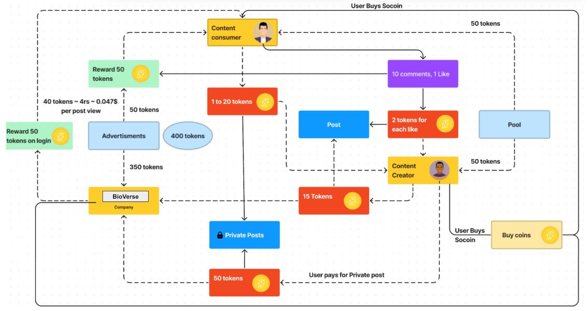

# BioVerse - Platform to Support BioHeritage

## Nowadays people have become selfish, They dont want to help others
## So lets use this selfishness for a good purpose
## This is the Tokenomics for doing so -> 

Welcome to Bioverse, a decentralized platform where users can engage with each other, earn tokens, and participate in various activities. Before diving into the platform, it's essential to familiarize yourself with some core principles and features.

## Tech Stack
- Ethereum
- Smart Contracts
- HTML/CSS
- Javascript
- React.js
- Solidity
- Polygon
- Soroban SDK
- Rust

## Soroban SDK
We utilized the Soroban SDK to develop the PolyFund smart contract for BioVerse, enabling efficient and secure fundraising for conservation projects. The contract includes features like setting funding targets, managing contributions, and ensuring transparency through contributor voting. Key functionalities include:

- Initialization: Setting up the funding manager, target amount, deadline, and minimum contribution.
- Contribution Management: Accepting funds from contributors and updating their balances.
- Voting and Requests: Allowing contributors to vote on fund requests and ensuring majority support for payments.
- Refunds: Providing refunds if the funding target is not met by the deadline.

## Core DAO Testnet Faucets
Before starting your journey on BioVerse, it's recommended to read about some core DAO (Decentralized Autonomous Organization) faucets. These are essential components of our platform, ensuring transparency, fairness, and community governance. You can find more information about these faucets [here](https://scan.test.btcs.network/faucet).

## Features

### Fund Raising for Early-Stage Startups
One of the main attractions of BioVerse is its crowd-funding section dedicated to early-stage startups for taking a step towards conserving BioHeritage. Here, venture capitalists (VCs) and individuals alike can contribute to startup projects, helping them raise necessary funds for their growth and development.

### Polygon
Ethereum's gas fees can be a barrier to entry for many users. BioVerse, by deploying on Polygon, can offer significantly lower transaction fees, making it more accessible to a wider audience. This aligns with Dconnect's goal of creating an inclusive and user-centric platform.

### Ethereum
Ethereum's robust security infrastructure provides a solid foundation for Dconnect. Users can be confident that their data and assets are protected by Ethereum's battle-tested security protocols.

## Getting Started
To begin your journey on Dconnect, follow these steps:

1. **Sign Up**: Provide a QR code corresponding to your Anon Aadhaar during signup for secure and anonymous authentication.

2. **Explore Features**: Take some time to explore the various features offered by Dconnect, including AI-generated content and crowd-funding opportunities.

3. **Engage with the Community**: Connect with other users, engage in discussions, share content, and participate in activities within the platform.

4. **Earn Tokens**: By actively participating and contributing to the community, you can earn tokens.

## Security and Privacy
At Dconnect, we prioritize the security and privacy of our users. We employ robust encryption methods and adhere to strict privacy standards to ensure that your data remains safe and secure.

## Feedback and Support
Your thoughts mean a lot to us! If you have any ideas, questions, or run into any problems using Dconnect, please don't hesitate to get in touch with our support team. Your feedback helps us make Dconnect better for everyone.
